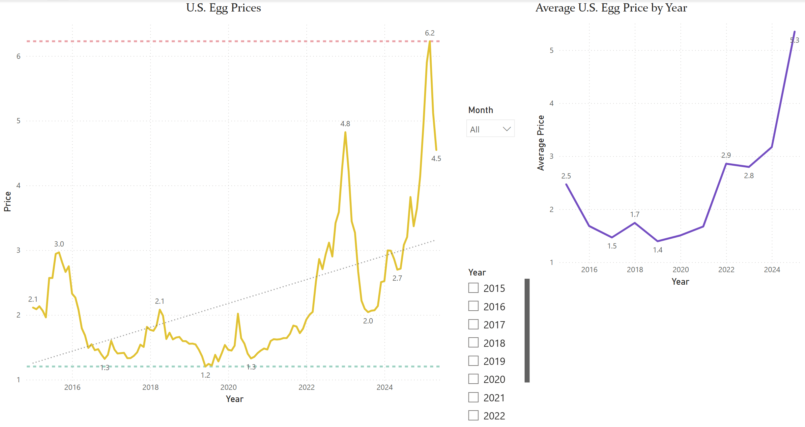

# Egg Price Trends Dashboard (Power BI)

📊 This Power BI dashboard visualizes the average price of a dozen Grade A large eggs in the U.S. from 2015 to 2025.

## Features
- Line chart of monthly prices over time
- Average annual price view
- Max and min price lines
- Month and year slicers for interactivity

## Dataset
Source: U.S. Bureau of Labor Statistics (CPI Average Price Data)

## Preview

## How to Use
- Download the `.pbix` file
- Open in Power BI Desktop
- Interact with slicers and filters

